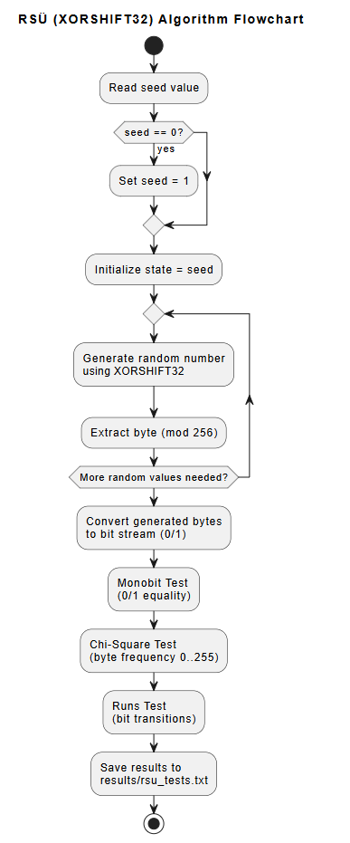

# RSÜ (XORSHIFT32) – Flowchart Description

Start
  |
  v
Read Seed
  |
  v
Seed = 0 ?
  |---- Yes ----> Set Seed = 1
  |---- No  ----> Continue
  |
  v
Initialize State
  |
  v
Generate Random Number (XORSHIFT32)
  |
  v
Convert Output to Byte / Bit
  |
  v
More Numbers Needed?
  |---- Yes ----> Generate Random Number
  |---- No  ----> Continue
  |
  v
Apply Statistical Tests
  - Monobit Test (0/1 equality)
  - Chi-Square Test
  - Runs Test
  |
  v
Display / Save Results
  |
  v
End

# RSÜ (XORSHIFT32) Algorithm Flowchart

The following flowchart illustrates the working principle of the
XORSHIFT32-based random number generator and the applied
statistical tests.

