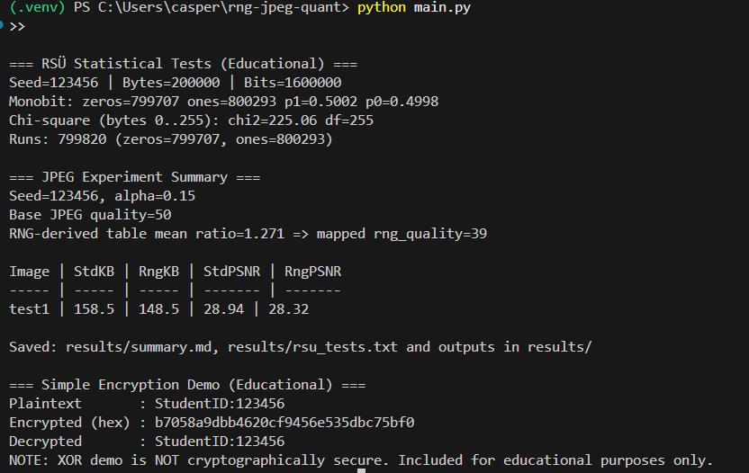

---

# 🎲 RNG Tabanlı JPEG Kuantalama Tablosu Deneyi

Bu çalışmada, rastgeleliğin sıkıştırma sistemlerindeki rolünü incelemek amacıyla  
basit bir sözde rastgele sayı üreteci (**XORSHIFT32**) gerçekleştirilmiştir.

Rastgele sayı üreteci doğrudan veri şifrelemek için kullanılmamış; bunun yerine  
standart JPEG parlaklık (**luminance**) kuantalama tablosu üzerinde kontrollü  
pertürbasyonlar uygulayarak alternatif bir **8×8 kuantalama tablosu** üretmek için
kullanılmıştır.

---

## 🧪 Yöntem
- Sözde rastgele sayı üreteci (**XORSHIFT32**) 구현 edildi
- RNG kullanılarak yeni bir kuantalama-benzeri tablo üretildi
- **OpenCV** kullanılarak JPEG sıkıştırma uygulandı
- OpenCV özel kuantalama tablolarını doğrudan desteklemediği için,
  üretilen tablonun kuantalama agresifliği JPEG **kalite parametresine** eşlendi
- Sıkıştırma performansı **dosya boyutu** ve **PSNR** metriği kullanılarak değerlendirildi

---

## 📊 Sonuçlar
RNG tabanlı yapılandırmanın, benzer PSNR değerleri korunurken daha küçük dosya
boyutu elde edilmesini sağladığı gözlemlenmiştir.  
Bu durum, **sıkıştırma–kalite dengesi** açısından olumlu bir sonuç olarak
değerlendirilmiştir.

---

## 📁 Üretilen Çıktılar
- `results/summary.md` : Sayısal karşılaştırma sonuçları  
- `results/rsu_tests.txt` : RSÜ istatistiksel test sonuçları  
- `results/*_std_*.jpg` : Standart JPEG çıktıları  
- `results/*_rng_*.jpg` : RNG tabanlı JPEG çıktıları  
- `results/quant_table_std.png` : Standart kuantalama tablosu  
- `results/quant_table_rng.png` : RNG tabanlı kuantalama tablosu  

---

## 🔐 Güvenlik Perspektifi
Bu çalışmada kullanılan rastgele sayı üreteci **kriptografik olarak güvenli
değildir**. Ancak deney, rastgelelik kalitesinin olasılıksal davranışa dayanan
sistemler üzerindeki etkisini göstermektedir.

Zayıf veya tahmin edilebilir rastgelelik; hem **güvenlik odaklı uygulamalarda**
hem de **multimedya işleme sistemlerinde** olumsuz sonuçlara yol açabilir.

---

## 🔑 Basit Şifreleme Gösterimi
Projeye, rastgele sayı üretecinin şifreleme bağlamında nasıl kullanılabileceğini
göstermek amacıyla **XOR tabanlı basit bir şifreleme örneği** eklenmiştir.

Bu örnek yalnızca **eğitsel amaçlıdır** ve **kriptografik olarak güvenli değildir**.  
Amaç, güvenlik sistemlerinde **rastgelelik kalitesinin önemini** vurgulamaktır.

---

## 📈 RSÜ İstatistiksel Test Çıktısı (Örnek)

Aşağıdaki ekran görüntüsünde RSÜ algoritmasının çalıştırılması sonucunda elde edilen  
**monobit**, **ki-kare** ve **runs** testlerine ait örnek çıktı gösterilmektedir.



---

## 🔧 Kurulum ve Çalıştırma

### Gereksinimler
- Python **3.9 veya üzeri**
- Git

### Kurulum Adımları

Depoyu bilgisayarınıza klonlayın:
```bash
git clone https://github.com/selanurayaz/rng-jpeg-quant.git
cd rng-jpeg-quant
```

(İsteğe bağlı ancak önerilir) Sanal ortam oluşturun:
```bash
python -m venv .venv
```

Sanal ortamı aktif edin:
```bash
.venv\Scripts\activate
```

Projenin Çalıştırılması

images/ klasörü içerisine en az bir adet .jpg veya .png formatında
görüntü dosyası ekleyiniz.

Ardından ana programı çalıştırınız:
```bash
python main.py
```


🛠 Kullanılan Teknolojiler

Python, NumPy, OpenCV, scikit-image


🌍 RNG-Based JPEG Quantization Table Experiment (English)

In this study, a simple pseudo-random number generator (XORSHIFT32) was implemented
to analyze the role of randomness in compression-related systems.

Rather than directly encrypting data, the RNG is used to generate an alternative
8×8 quantization table by applying controlled perturbations to the standard JPEG
luminance quantization table.

Method

Implemented a PRNG (XORSHIFT32)

Generated a new quantization-like table using RNG

Applied JPEG compression using OpenCV

Mapped the aggressiveness of the generated table to the JPEG quality parameter

Evaluated compression performance using file size and PSNR

Results

The RNG-derived configuration achieved a smaller file size while maintaining
comparable PSNR values, indicating a favorable compression-quality trade-off.

Security Perspective

This experiment demonstrates how randomness quality directly affects systems that
rely on probabilistic behavior. The implemented RNG is not cryptographically secure
and is included for educational purposes only.
